# 【持续更新】关于境外势力渗透武汉大学、形成极端“女权”群体并进行网络攻势的线索合订本

**来源**：[【持续更新】关于境外势力渗透武汉大学、形成极端“女权”群体并进行网络攻势的线索合订本](https://zhuanlan.zhihu.com/p/1936163967102870702)

**注，涉及对象主要包括但不限于：**

美国福特基金会（Ford Foundation）

香港乐施会(Oxfam Hong Kong）

武汉大学法学院、经济管理学院、资源与环境科学学院、人权研究院、公益与发展法律研究中心

武汉大学简德协会、性别性向平等协会

武汉大学官方微博

杨景媛 “武大图书馆诬告案”女方当事人

吕频 “女权之声”创始人，长期在境外活动

刘雅婷 《环球时报》记者，被指转发极端女权推文

吴若兰 英国驻华大使，被指扶持简德协会

方方 武大校友，《封城日记》作者

王懿 武大新闻与传播学院校友

冯济海 南京财经大学教师

宋庚一 上海震旦职业学院讲师

单波 武汉大学新闻与传播学院副院长

汪诗韵 湖北省教育厅电教馆工作人员，武大校友

武思晗 武大新闻与传播学院硕士生

复旦大学、哈尔滨工程大学、华中科技大学、浙江海洋大学、华中农业大学、中国地质大学、同济大学

豆瓣“生活组”（70 万＋成员）及其“内部组”

大规模匿名水军账号（微博、小红书、豆瓣等平台）

近期，“武大图书馆诬告案”引发剧烈舆情，极有可能是一场境外势力经过长期潜伏发育、在社会矛盾激化阶段策动的颠覆国家政权行动。根据公开信息梳理，发现大量关于涉及武汉大学校内机构、在校学生及校友涉嫌与境外势力接触、在国内煽动极端女权思潮的信息，可整理为三条重要线索：

**线索一：武汉大学校内机构接收境外势力巨额资助，为境外势力编纂有颜色革命性质的“毒教材”，培植内地代理人，在境内组织串联活动。**

**线索二：武汉大学校内极端女权组织网络围攻国家机关及工作人员，通过网络煽动、舆论施压、人身胁迫等方式干扰正常司法程序。**

**线索三：武汉大学微博公众号与多家内地公众号联动，在“八一”建军节发布极端女权宣言。**

具体线索如下：

## 一，武汉大学校内机构接收境外势力巨额资助，为境外势力编纂有颜色革命性质的“毒教材”，培植内地代理人，在境内组织串联活动。

### **1、多家武汉大学校内机构收受美国福特基金会的巨额资助，按照出资方要求开设女权主义课程、研究、活动。**

武汉大学法学院、人权研究院、武汉大学公益与发展法律研究中心等单位确实拿了福特基金会的钱，以保护弱势群体的学术名义，行宣扬女权主义意识形态等具有行动主义前置观念的渗透手法。这些项目已在美国福特基金会官网披露：

https://www.fordfoundation.org/work/our-grants/awarded-grants/grants-database/wuhan-university-105339/

https://www.fordfoundation.org/work/our-grants/awarded-grants/grants-database/wuhan-university-112346/

https://www.fordfoundation.org/work/our-grants/awarded-grants/grants-database/east-lake-institute-for-social-advancement-wuchang-district-wuhan-148947/

武汉大学自2006年起接受了福特基金会4项捐助，另有涉及到武汉大学的1项（详见5#），具体如下：

1# **为法学院制定和传播中国法学院的性别与法律教科书和课程**

项目名称：For the School of Law to develop and disseminate a gender and law textbook and curriculum for Chinese law schools
受资助者：Wuhan University（武汉大学）
金额：$36,724
时间：2009
连接：[112346 - Wuhan University - Ford Foundation](https://link.zhihu.com/?target=https%3A//www.fordfoundation.org/work/our-grants/awarded-grants/grants-database/wuhan-university-112346/)

**2# 资源与环境科学学院编写中国第一本国家性别平等与发展地图集，按性别划分关键人口特征**

项目名称：For the School of Resource and Environmental Science to prepare the first Chinese national Atlas of Gender Equality and Development disaggregating key population characteristics by gender
受资助者：Wuhan University（武汉大学）
金额：$93,325
时间：2007
链接：[105339 - Wuhan University - Ford Foundation](https://link.zhihu.com/?target=https%3A//www.fordfoundation.org/work/our-grants/awarded-grants/grants-database/wuhan-university-105339/)

3# **让公共利益与发展法律研究所研究参与大学法律服务计划对法学院学生职业选择和专业发展的影响**

项目名称：For the Public Interest and Development Law Institute to study the impact participation in a university-based legal services program has on law students’ career choices and professional development
受资助者：Wuhan University
金额：$46,070
时间：2011
链接：[116336 - Wuhan University - Ford Foundation](https://link.zhihu.com/?target=https%3A//www.fordfoundation.org/work/our-grants/awarded-grants/grants-database/wuhan-university-116336/)

4# **为公共利益与发展法学院举办为期两天的公共利益法职业论坛和法律非政府（NGO）组织和法律学生招聘会**

项目名称：For the Public Interest and Development Law Institute to hold a two-day public interest law career forum and jobs fair for legal NGOs and law students
受资助者：Wuhan University（武汉大学）
金额：$140,000
时间：2013
链接：[120044 - Wuhan University - Ford Foundation](https://link.zhihu.com/?target=https%3A//www.fordfoundation.org/work/our-grants/awarded-grants/grants-database/wuhan-university-120044/)

**5# 向穷人和弱势群体提供法律援助，并进行研究、宣传和外展活动，以推广公共利益法的概念和积极影响**

项目名称：
受资助者：Center for Protection for the Rights of Disadvantaged Citizens of Wuhan University（武汉大学弱势公民权益保护中心）
金额：$242,677
时间：2012
链接：[116322 - Center for Protection for the Rights of Disadvantaged Citizens of Wuhan University - Ford Foundation](https://link.zhihu.com/?target=https%3A//www.fordfoundation.org/work/our-grants/awarded-grants/grants-database/center-for-protection-for-the-rights-of-disadvantaged-citizens-of-wuhan-university-116322/)
注：武汉大学法律援助中心（原社会弱者权利保护中心）成立于1992年5月，是中国首家依托高校设立的民间法律援助机构，由武汉大学法学院运营，主要为妇女、未成年人、残疾人等弱势群体提供公益法律服务。

### **2、收受资助后，武汉大学校内产生大量具有严重意识形态问题的教学活动、研究作品。**

大量意识形态颜色革命议题（特别是涉及性别这类敏感议题）的倾灌，培育出一大批问题学者，也就进一步孵化出一批问题成果。下图是武汉大学近年来女权主义问题课堂、问题论文的典型代表。这些成果既是以性别问题作为切入口，污名化男性、家庭、国家，挑动性别对立，分裂社会，为颠覆国家政权做思想灌输。

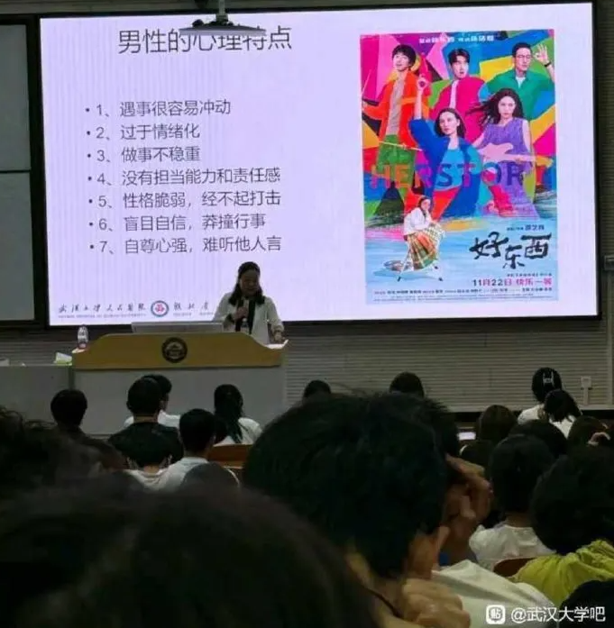

武汉大学课堂公然污名化男性，挑起性别仇恨，ppt左下角证明该图来自武汉大学课堂。

武汉大学法学、经济学、新闻学、传播学甚至部分工科专业出现大量夹杂极端女权主义观点的学位论文。**值得注意的是，这些具有严重意识形态问题的论文通过了严格的学位评定流程层层审核，疑似被接收资助的校内机构“打招呼”“开绿灯”。部分典型篇目如下：**

武汉大学某学生以豆瓣小组（女权主阵地）为研究主题的硕士论文

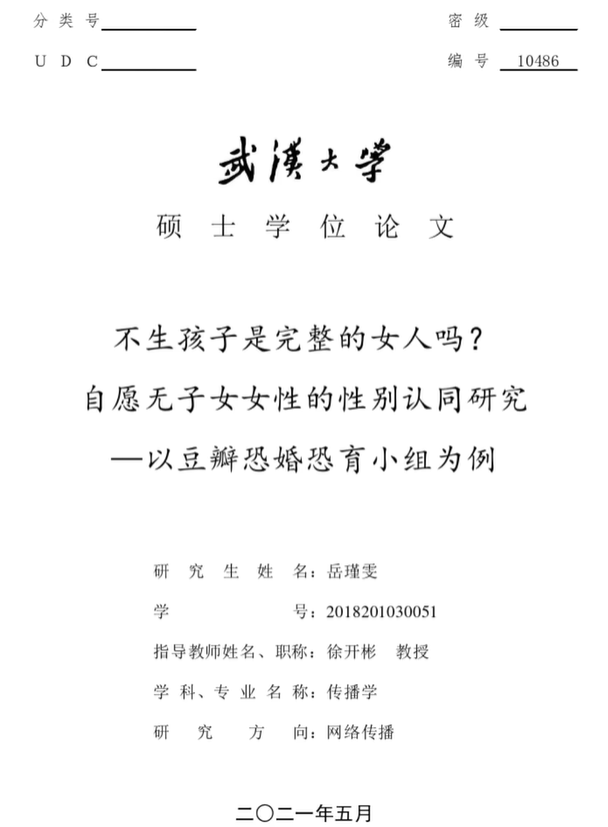

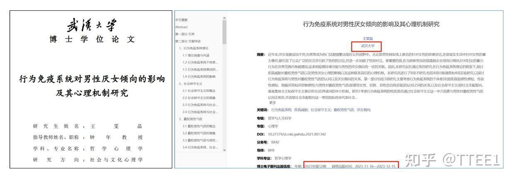

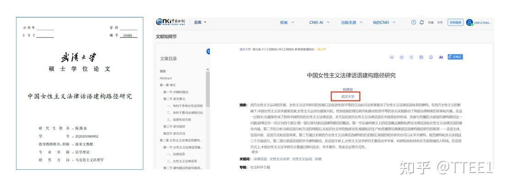

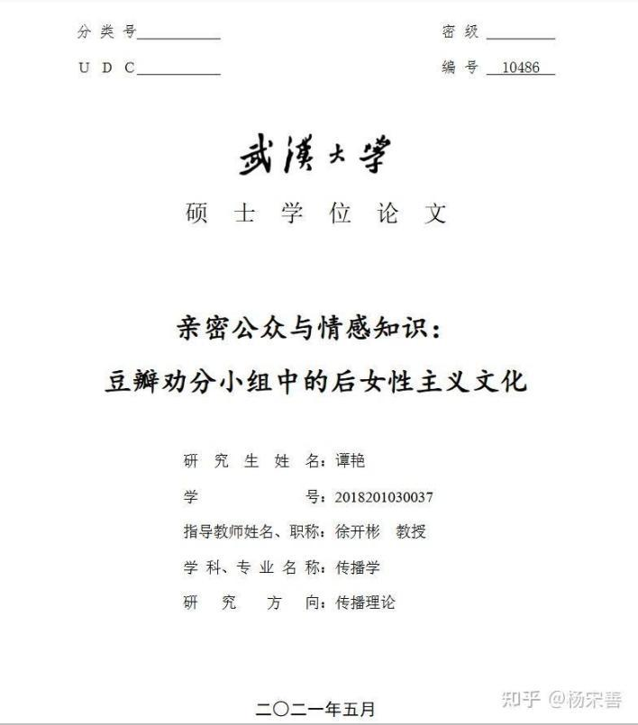

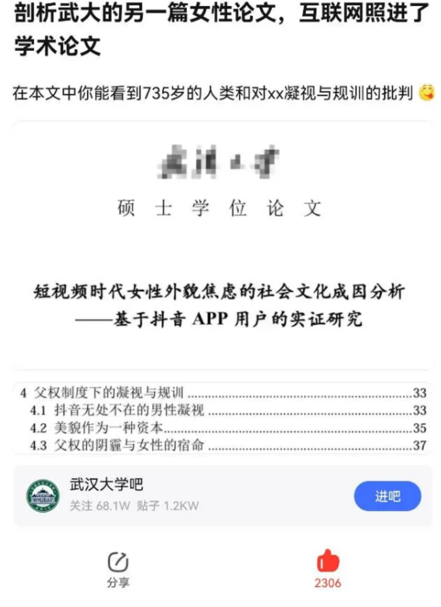

还有的学位论文**公开诋毁母亲、仇视婚育**，将正常生育行为污名化为社会压迫。

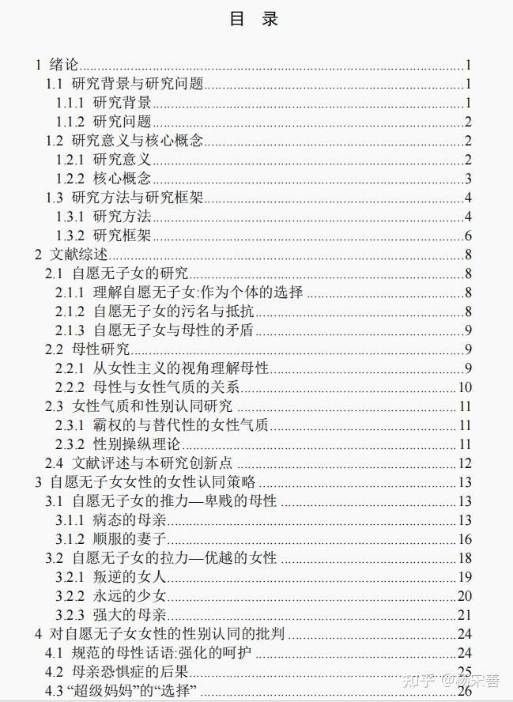

该校个别专家学者亦产出**历史虚无主义论文**，遭到社会质疑和抵制：

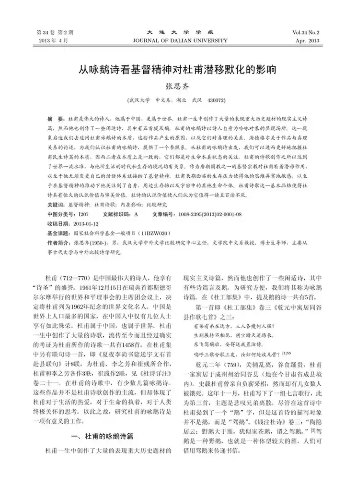

## **二，“武汉大学图书馆诬告案”涉事人杨某媛的学位论文不仅存在严重意识形态问题，且有大量学术不端痕迹，后被保送至香港浸会大学读博，疑似得到境外势力系统培养。** 

[杨景媛论文问题汇总](https://github.com/zouzhekang/YJYpaper)

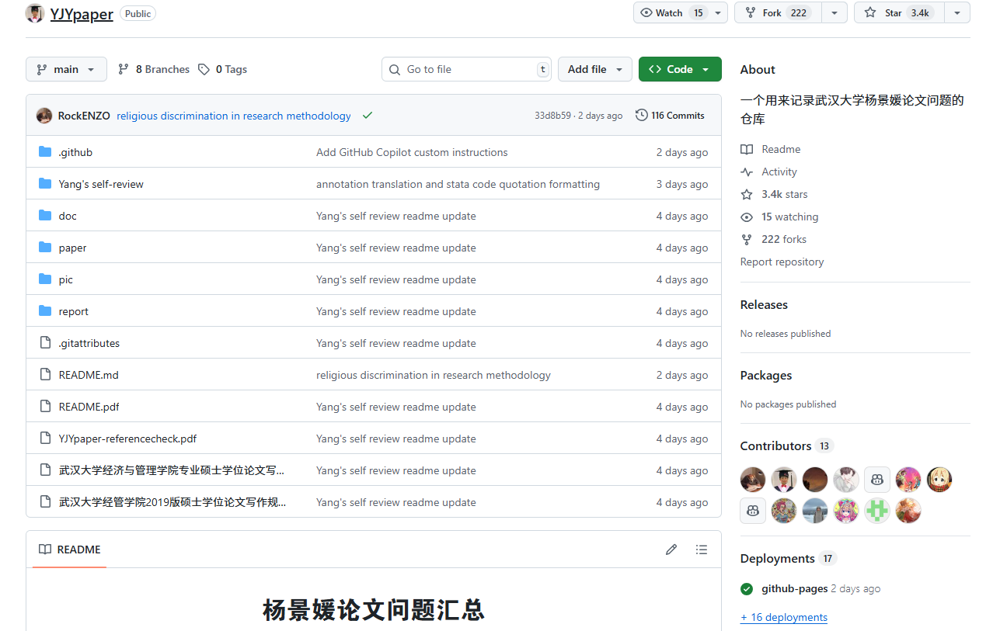

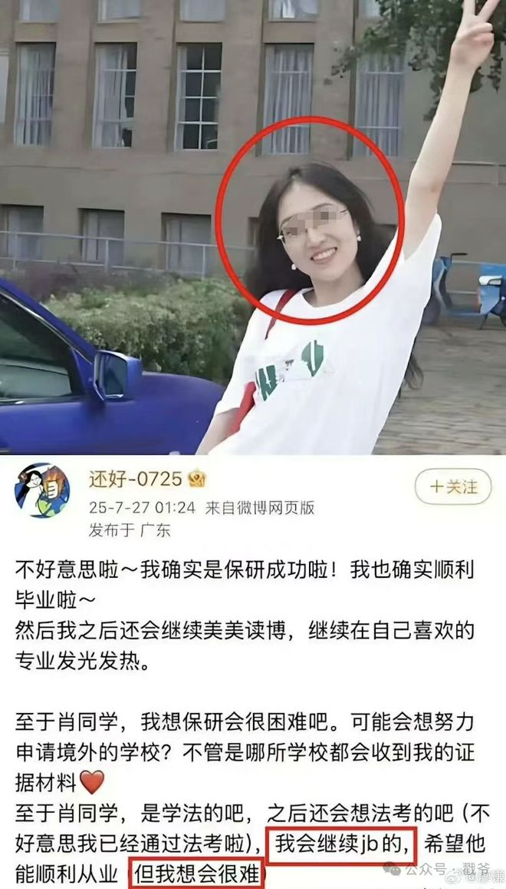

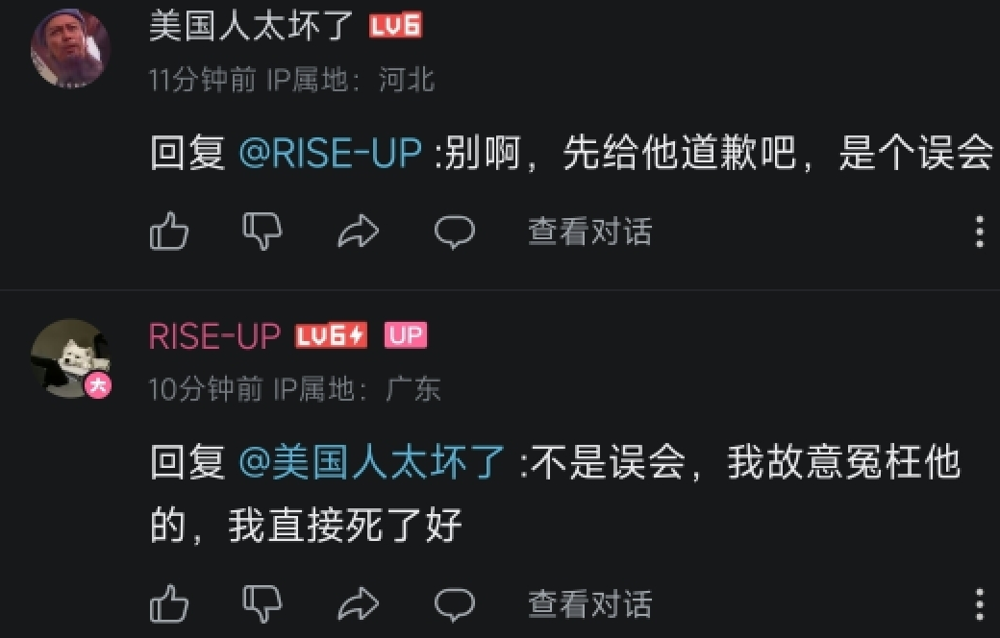

### **1、大量曾就读于武汉大学受境外势力资助专业的公共人物发表涉嫌反党反社会、极端女权主义、历史虚无主义言论和行为失范。**

1. 武汉大学校友方方1982年毕业于该校中文系，写日记爱好者。代表作是2020年写的封城日记，诋毁我国防疫政策。事后入选BBC年度【巾帼百名】。

2. 王懿2009年毕业于武汉大学新闻与传播学院。在境外媒体公开称呼中国为“支那”，并恶毒地诅咒同胞，后在日本去世。

3. 南京财经大学新闻学院教师冯济海：用“918事变”侮辱东北同胞，被责令公开道歉、调离教师岗。

4. 上海震旦职业学院传媒艺术学院讲师宋庚一：说“南京大屠杀”没有理论依据，只是“民间传说”，被开除教职，被曝曾参与编写多部大学教材，丈夫是日本人。
   以上俩人师出同门，导师是波尔多三大传播学客座教授、美国“跨文化中心”高级研究员、中国新闻史学会第六届理事会副会长、被列入“湖北省跨世纪学术骨干”的武汉大学新闻与传播学院副院长单波。

5. **武大新闻系毕业的汪诗韵，此前被报道在湖北省教育厅电教馆工作，主持教育信息化。**通过其公开论文可以查询到个人信息。[1]***汪诗韵.中小学校长信息化领导力提升策略[J].湖北教育(政务宣传),2022,(10):21-22.***。其现用微博账号为@星星与花wsyyy，还有一个号因发表反动言论被查封。

6. 武汉大学新闻与传播学院硕士生武思晗，在参加国际辩论赛事时宣称“中国女性文盲率70%”“每年中国死去3000万女婴”等严重不实信息。

   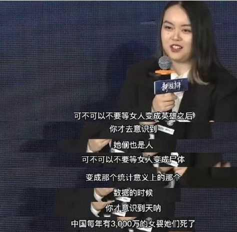

   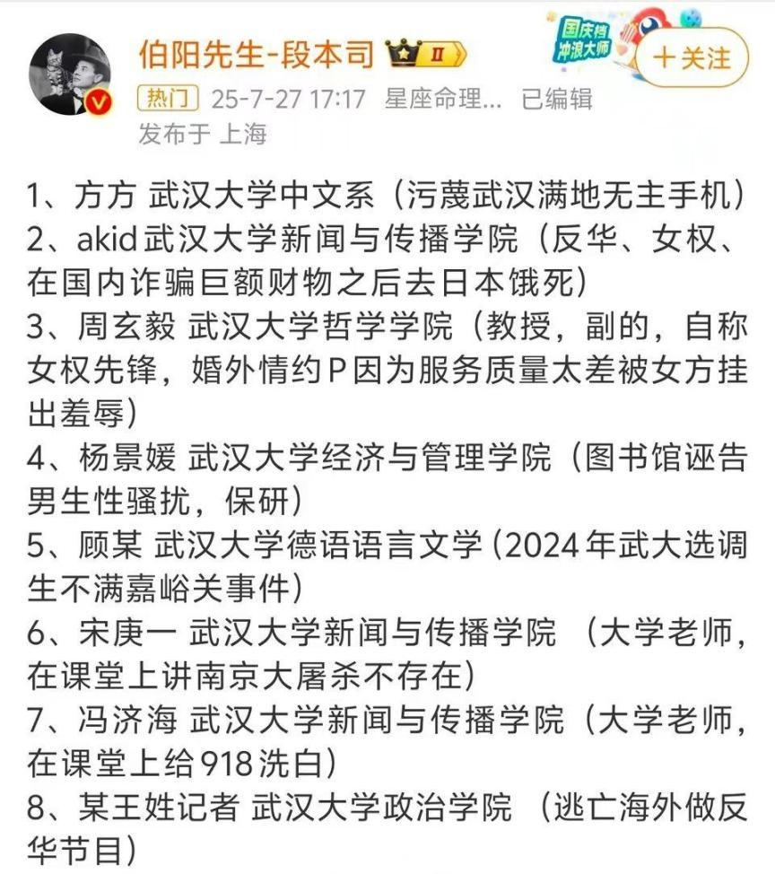

网友对存在意识形态问题的武大师生校友的梳理

**以上这些都是“名噪一时”的人物，并且每一次都引发了公众对武汉大学、“新闻学”的批评，但是每一次的风浪都未带来实际改善，且“屡挫屡犯”。**

**任何一个地区、组织、机构都可能会偶然产生具有意识形态问题的“个别人”，只会是极小概率事件。但如此集中地出现在武汉大学收受境外资助的机构之中，不难推测其内部已形成系统培养境外颠覆势力代理人的组织链条。**

### **2、武汉大学校内机构、学生社团仍在以学术研讨、国际交流为名义，公开进行境内串联活动。**

2014年，武汉大学珞珈公益法律职业发展论坛邀请知名女权人士吕频，以“女权主义、法律人和社会变革”为题开展讲座，主办方均得到福特基金会资助。

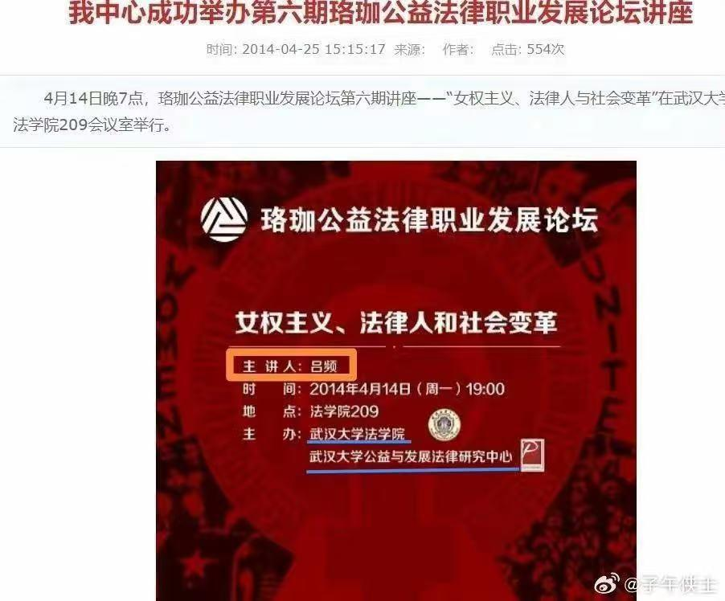

吕频是国内“女权之声”的创始人，极端女权主义代表人物，她是前《中国妇女报》妇女权益部主任，**她与武大参与过WHU性别平等研究会。**2012年，她策划穿涂有口红的染血婚纱照，脸上带着“伤口”走上北京街头，其旨在提升公众对家庭暴力问题的关注。同年策划“裸～活动”，其剃光头将照片发到社交媒体上。她还转发港独推特。**她受美国NGO组织，在香港注册“香港乐施会”开展极端女拳活动对接境外资源，2015年因策划参与极端女拳活动逃往美国，后滞留。著名的朱军被污蔑性骚扰事件，就是她在后面推动的。**

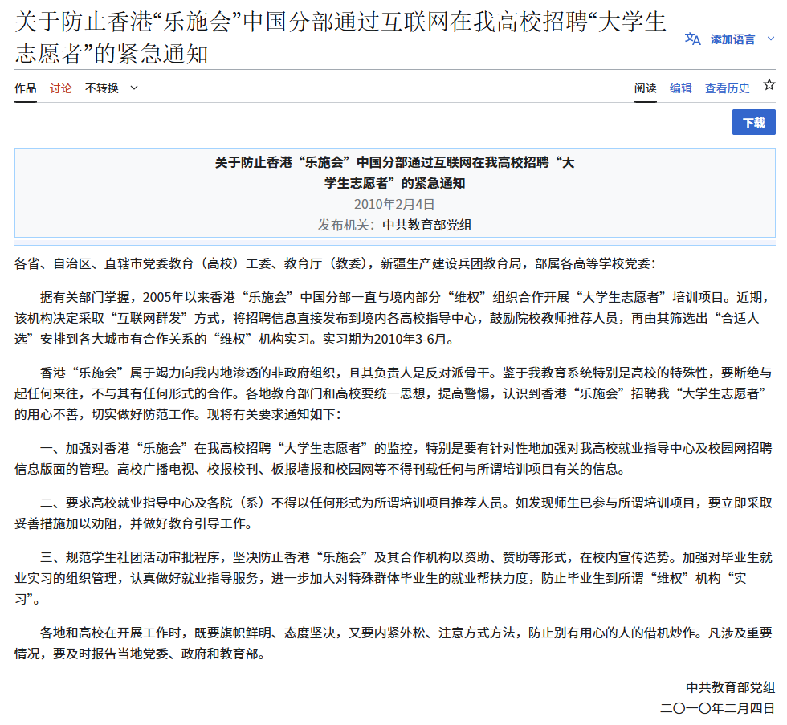

**我们仍未知道，这个讲座是如何将“女权主义”与“社会变革”放在一起讨论的，她们要变革什么？而与此同时，类似吕频这样的体制内宣传工作者，在此次武汉大学图书馆诬告事件中，也暴露出其女权主义立场。《环球时报》记者刘雅婷就在其朋友圈转发丑化、污蔑男性的极端女权公众号推送。**

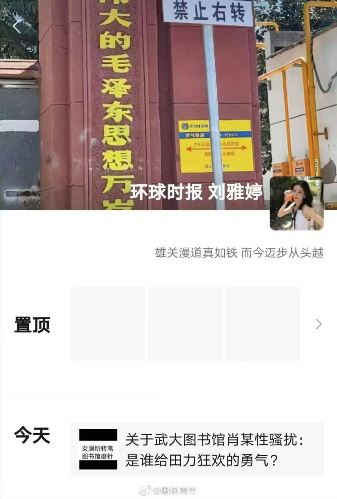

**《环球时报》记者刘雅婷就在其朋友圈转发丑化、污蔑男性的极端女权公众号推送**

同时也能看到，**自接受境外势力资助后，武汉大学校内产生大量恶劣的极端女权活动，形式包括游行、示威、集会等。**

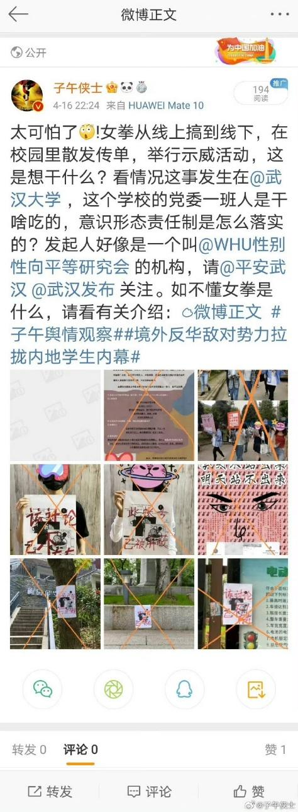

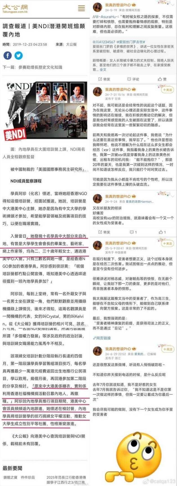

**组织女权活动的学生群体主要来自两个社团：性别性向平等协会、简德协会**。

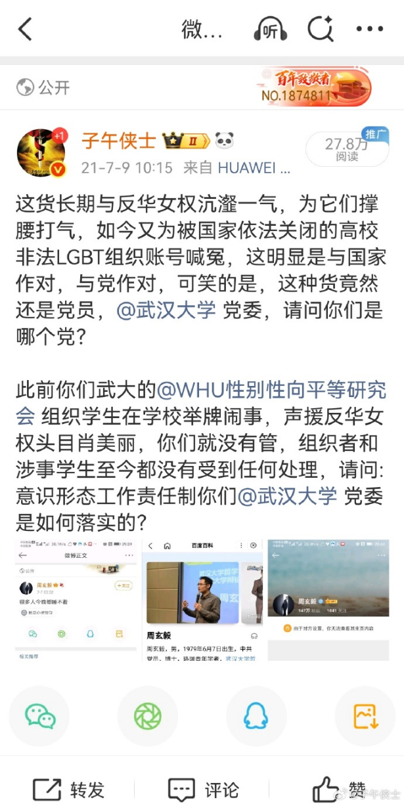

网友爆料性别性向平等协会是组织女权活动的主力

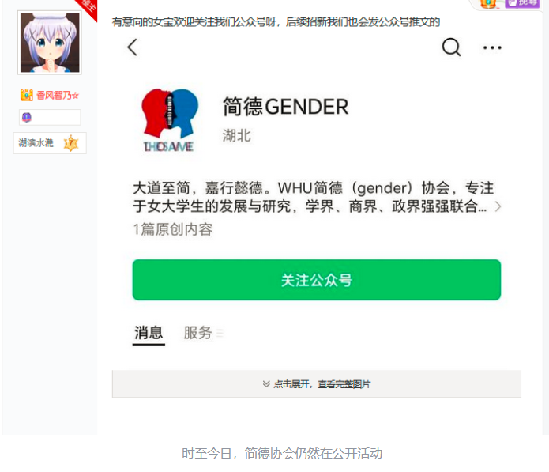

**简德协会颇受西方国家重视，现任英国驻华大使吴若兰，搞所谓女权外交，其重点就是扶持武汉大学的意识形态颜色革命。**公开资料显示，吴若兰在疫情期间曾访问武汉大学。武汉大学副校长李斐会见，国际交流部相关负责人参加会见。在这次行程中，吴若兰与经济管理学院邹薇教授和简德协会的师生代表就宏观经济情况和女性职业发展话题进行交流。而武汉大学经济管理学院也正是此次武汉大学图书馆诬告案女方所在院系，也是其漏洞百出的毕业论文顺利过关所经过的第一责任人。

**英国大使为何只接见经管学院教授、简德协会学生？这次活动的目的是什么，她们又交流了什么，目前尚不清楚。**

“武汉大学图书馆诬告案”涉事人杨某媛以自杀要挟本案庭长，试图利用司法人员善心达成不正当目的。事实上，这是一种常见的海外极端组织做法，诸多以环保、女权为名义的极端组织会通过自残、声称自杀等方式到达其要挟当局的政治目的。

同时，杨某媛将她与庭长的聊天记录对外曝光，形成一种“庭长不顾原告死活”的假象，使得庭长及相关办案、审判人员陷入网络暴力之中。

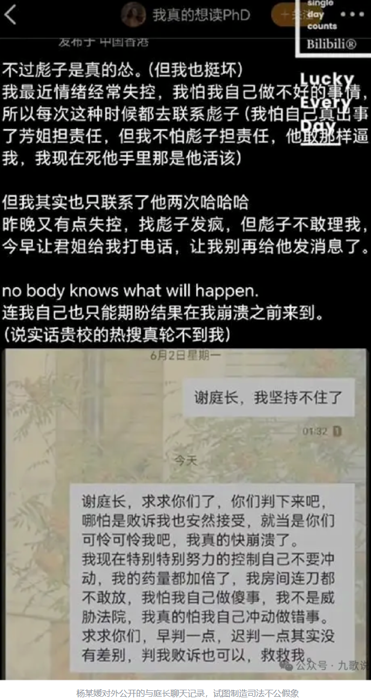

### **3、为什么杨某的底气那么足？因为她得到了具有境外势力背景的多方帮助。**

**其一，简德协会“替”她与法官多次“沟通”。简德协会并非具有法律咨询资质的社会组织，也与该案无直接相关，却直接介入其中。（下图）**同时，也有部分网友反映审理该案的庭长遭遇“开盒”，是顶住巨大网络暴力秉公守法完成了一审判决。难以想象戕害国家工作人员的行为会在当代发生。

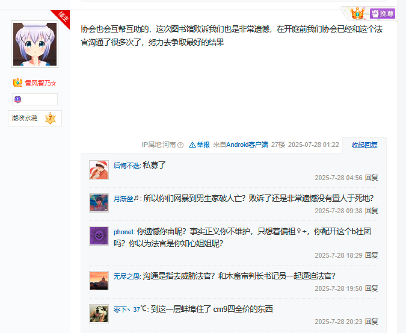

**其二，杨某媛的代理律师是知名的极端女权主义者和NGO组织参与者，专门为各类女权主义群体、性少数群体提供法律“援助”。该律师不仅不避讳，还公开接受海外反动媒体采访，抨击中国内政。（下图）**

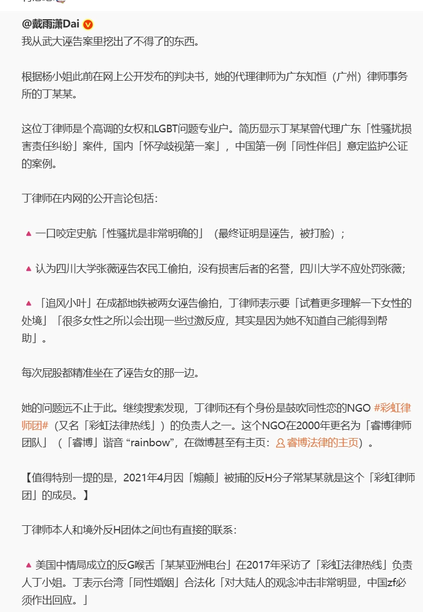

## **三，一大批极端女权主义博主与杨某媛做照应，发布大量仇恨言论、极端言论、散步不实谣言，煽动社会矛盾。**

2021年发生了豆瓣极端女权小组鼓励谋害男婴，以及同时有成员付诸行动，事件发生后，豆瓣小组内一片叫好，称赞凶手董某萍，这些言论都能在知乎上找到截图，**后来据说董某萍以精神疾病为由逃脱了法律制裁。**后豆瓣被约谈，罚款，功能整改。

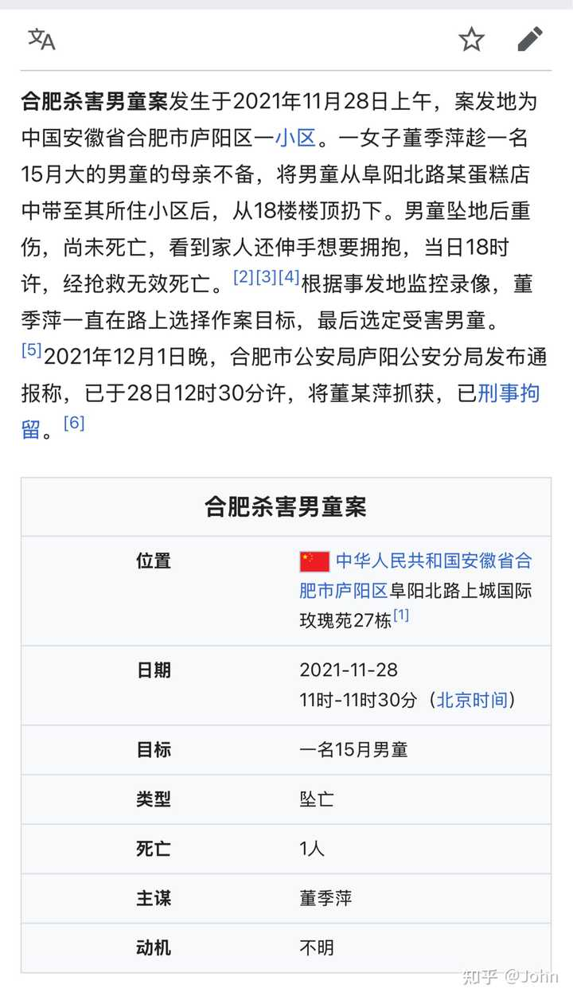

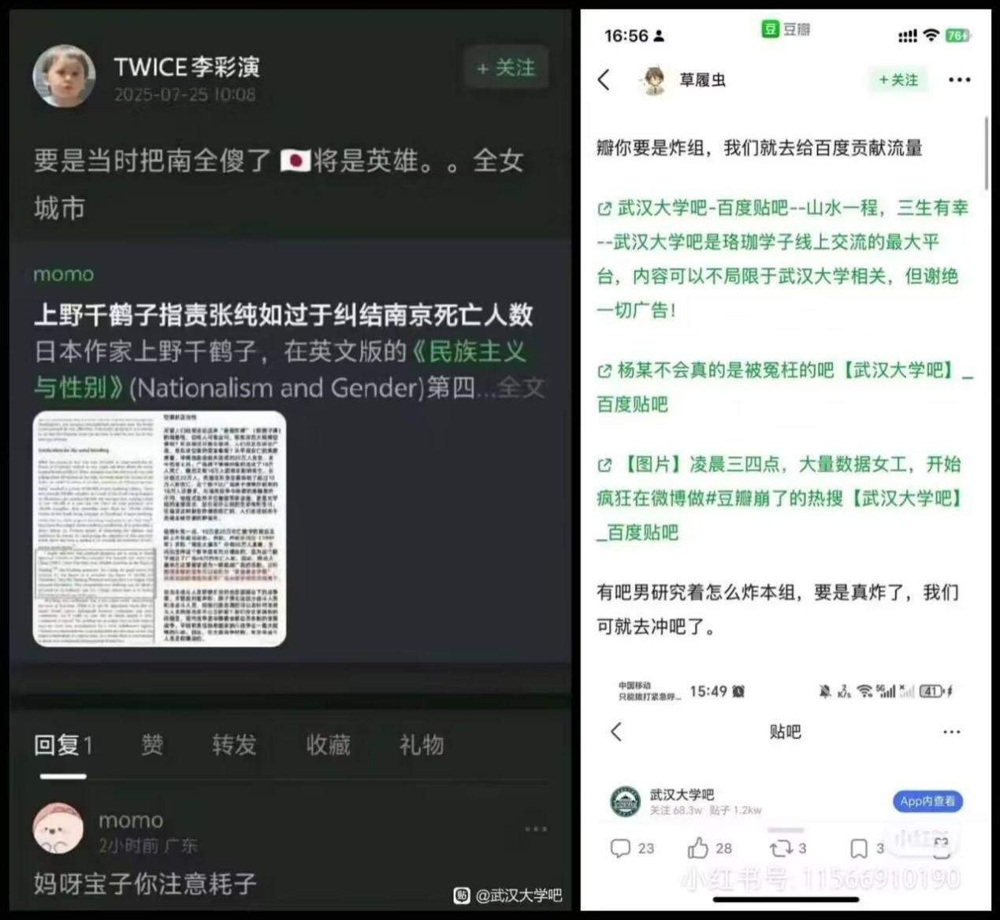

一女权博主在舆情高涨期间发布要日本“杀光男性”的极端言论

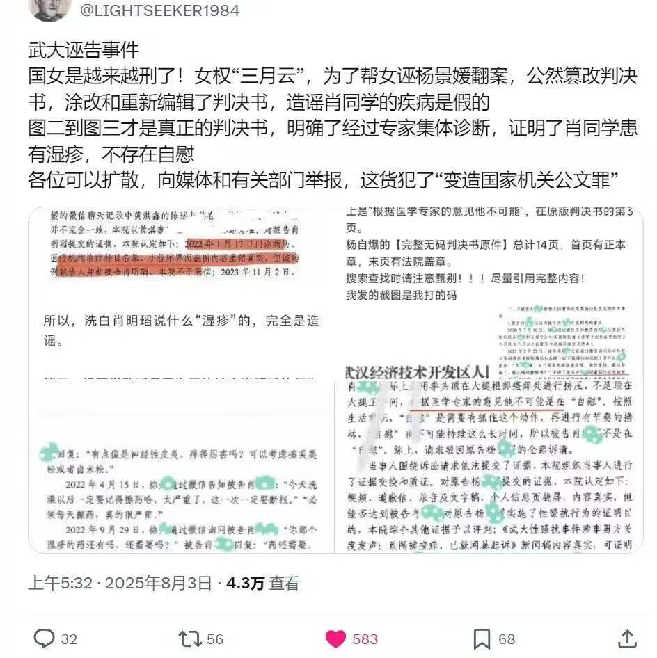

一女权博主伪造判决书，被网友识破

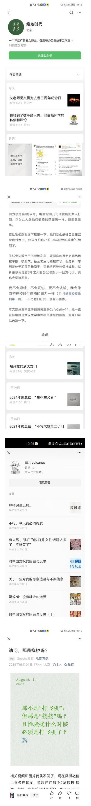

多个极端女权账号试图将杨某媛从加害者角色塑造为“受害者”形象以混淆视听

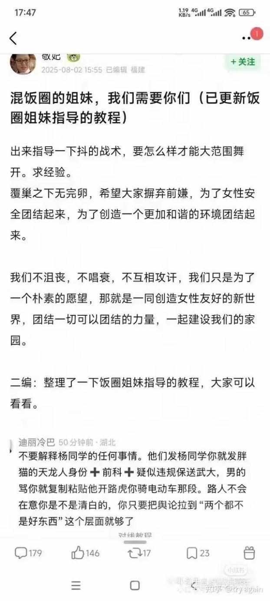

豆瓣博主提供“造谣攻略”

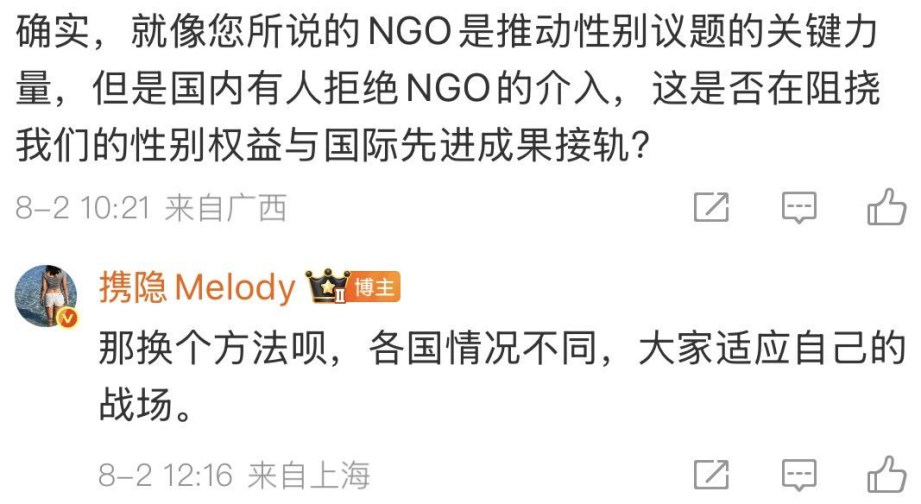

一女权博主将性别议题称为“战场”，她的敌人是男性还是国家？

从8月2日晚开始一直到3日今天凌晨5多，小红书、豆瓣、微博出现大规模造谣抹武汉大学图书馆诬告事件受害者男方当事人肖同学的帖子和评论。这些水军趁着大半夜，大规模造谣控评。（小红书搜关键词：豆瓣崩了。全是抹黑造谣贴）昨天晚上至少刷到几千个水军账号，在大规模控评造谣。都是写豆瓣崩了开题，然后开始造谣抹黑肖同学。

**到了早上，这些水军账号好像销声匿迹了一般。到底是谁在操控这些水军账号？**

1. 武汉大学社交媒体与多家高校串联，在“八一”建军节发布极端女权宣言。
   在武汉大学图书馆诬告女败诉以及武汉大学迫于社会压力表示将处分诬告女和调查其论文问题后，潜伏在武汉大学及其兄弟院校新媒体宣传部门的女权主义者，不断黑话对外界“打信号”，释放女权主义的行动宣言作为暗示，并开始了污名化男性的新举动。同时，许多自称武大校友的人通过极端女权叙事来力挺诬告女杨某。
   2025年7月27日，武汉大学微博官方账号发布“冷冻肉”事件杀男梗，以宣扬仇男主义。
   [https://www.bilibili.com/video/BV1N5h4z2Eeu/](https://www.bilibili.com/video/BV1N5h4z2Eeu/)
2. 2025年8月1日，建军节当天，复旦大学、哈尔滨工程大学、华中科技大学（8.2发布）、浙江海洋大学官方微博集体发布**法国作家波伏娃（被现代极端女权主义者视为精神图腾，是极端女权运动的动员符号）**作品《清算已毕》中的**“我能确定的是，我一定会走出困境。人生最初的十八年时光塑造了我，我不会背叛那一切”“我相信，我决定，我满意我自己”**，隔空声援、站队武汉图书馆诬陷事件始作俑者杨景媛，后背是境外反动势力的串谋。

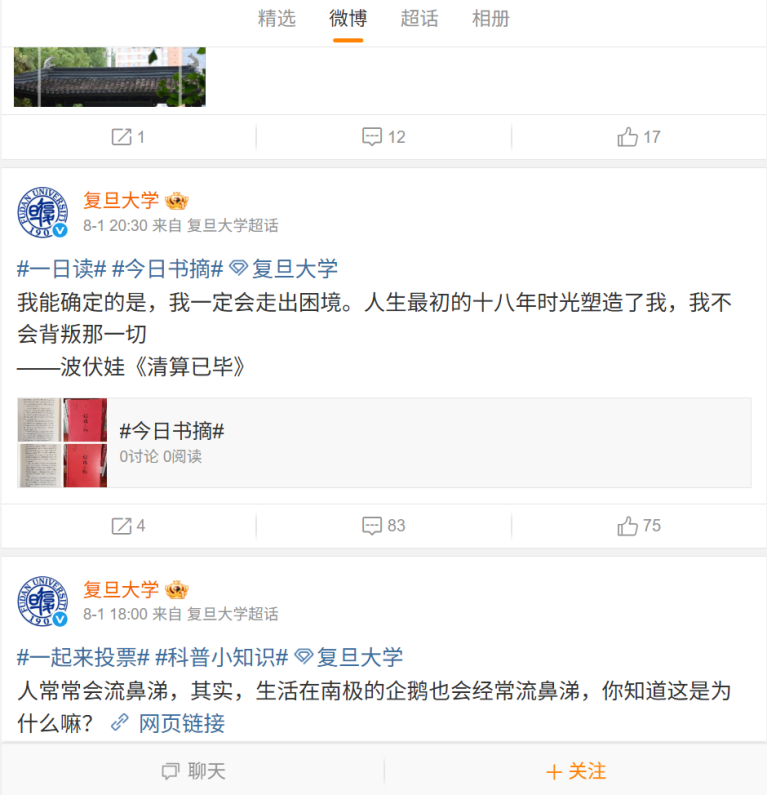

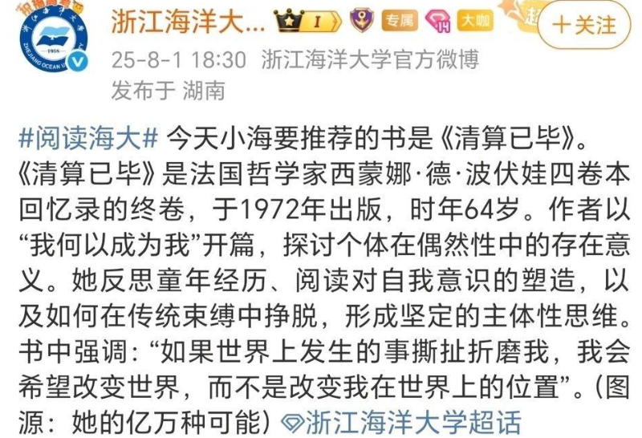

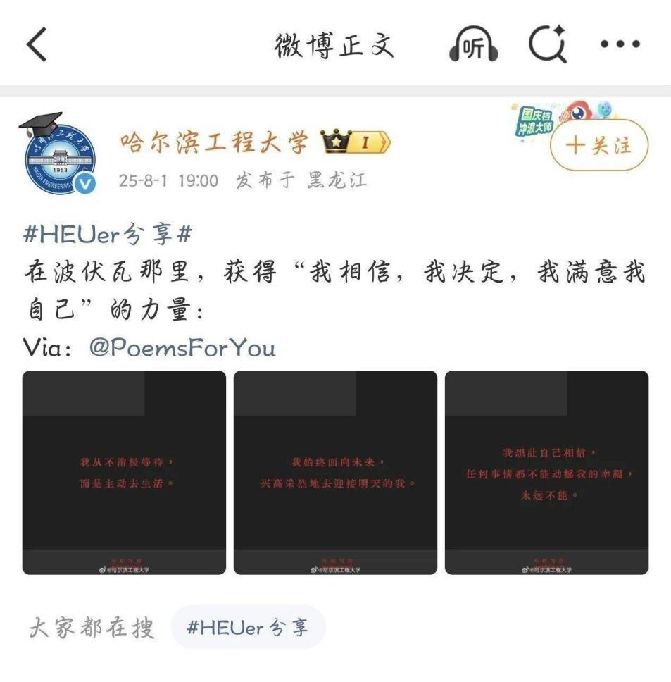

相关高校微博号集中发送同一条极端女权标语

在网民调查后发现，类似的女权主义政治“狗哨”早就在高校新媒体宣传口暗中发展了许久，即用“只有自己人听得懂的暗号打招呼”。像下图中的华中农业大学、同济大学，都曾有过类似的行为。

（即：“波伏娃”全都写成“波伏瓦”这样的小众音译）

这种遥相呼应、暗送秋波的女权主义狗哨政治确实是颜色革命的惯用伎俩。中东颜色革命前期，都是与政治无关的所谓人权诉求，经过几次运动，它们提升了组织度，颜革就开始了，发生颜革的国家里，本土的颜革热点人物很多都是女的。

极端女权主义的国内大本营设在“豆瓣”生活组，组内有70余万人（几乎全为女性），成组织、规模地恶意散布污名化男性的言论，刻意制造男女对立的社会矛盾，且自称为“革命”。该组暴露后，后台组织人员又新设立准入更严格、更极端的内部组，目前已逾20万人（同样全为极端、反社会女权主义者），继续从事打着女权主义旗号的颜色革命。

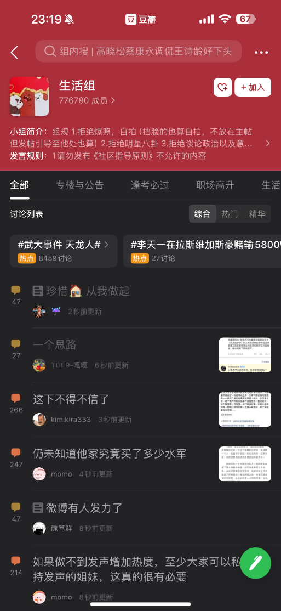

在互联网舆论外围，高校系统内的女权主义者、颜色革命势力同体制外的饭圈化的微博、豆瓣用户形成串联态势，并通过雇佣水军，一同充当女权主义等意识形态颜色革命的打手，以左右舆论走向、干扰司法、扭曲社会价值观。这些女性信口雌黄、颠倒黑白、造谣生非、死不认错、网暴开盒、宣扬杀男仇男、鼓吹全女模式，用性别理论破坏社会主义男女团结传统、分裂社会的做法，已经成为影响我国社会大局稳定和国家意识形态安全的毒瘤。

## 四，线索总结与建议

三条线索是紧密联动的，这反映出一个令人痛心的事实：境外势力打着改善妇女群体发展状况的名义，实际上已经对境内高校、媒体、部分女性群体实现了思想洗脑，将其作为扰乱社会秩序、颠覆国家政权的“棋子”。极端女权主义打着政治正确旗号，公开进行反党、反国家、反社会主义的活动，并从过去的散点化、独狼式行动转化为规模化、群狼式攻击，极大恶化了国内社会环境和网络氛围，已经产生了不可忽略的破坏侵蚀作用。

杨某媛作为一个在读研究生，仅凭自身能力不可能做出如此“娴熟”“老道”的操作，背后必有“高人指点”。我作为局外人，仅凭公开信息就能推断出武汉大学部分机构已经成为了境外势力培养、联系、组织国内代理人开展女权运动的枢纽，很难想象在我们看不到的地方已经何等触目惊心。

更令人难以想象的是，境外势力是如何操纵诸多高校的微博账号管理人员，在同一时间发出极端女权宣言。众所周知，任何学校都有媒体管理工作机制，不大可能是一群互不认识的人在同一时间做了相同的事，这也说明境外势力对内地高校的渗透不止发生在武汉大学，甚至可能已经成为了普遍现象。

境外势力渗透武汉大学、形成极端“女权”群体并网络围攻国家机关及公职人员，这些极端分子在法律已有明文禁止的情况下仍公然煽动仇恨、攻击国家机关，显系明知故犯、恶意对抗。其行为不仅动摇法治根基，更企图撕裂社会性别关系，危害国家长治久安，严重践踏国家法律法规，严重违反党章、党内法规，挑战社会主义法治权威，应该受到最严厉的追究和惩处。

我国《国家安全法》明确将“防范境外势力渗透、破坏、颠覆、分裂活动”列为底线红线。这些女权主义者、相关NGO及社会活动家接受境外基金会资助、煽动性别仇恨并攻击国家机关，违反《国家安全法》，亦符合《刑法》第一百零五条“组织、策划、实施颠覆国家政权”与第一百零六条“与境外组织相勾结”范畴。

《网络安全法》第十二条、第十三条要求任何个人和组织不得利用网络煽动颠覆、传播极端主义、编造谣言扰乱社会秩序。《网络信息内容生态治理规定》第五条明确禁止发布危害国家安全、破坏国家统一，宣扬民族、地域、性别歧视或仇恨，散布谣言、扰乱社会秩序的内容。《互联网用户公众账号信息服务管理规定》第八条规定，公众账号不得发布“煽动社会矛盾、散布谣言、歧视攻击他人”的信息。本次事件及长期以来相关事件中，女权主义者操纵水军发布“杀男”“全女社会”等仇恨信息，对公职人员“开盒”围攻，已构成扰乱公共秩序与危害国家安全的违法活动，平台亦负有立即删除、报告的法定义务

通过线索，可总结以下疑点：

1. 美国福特基金会的资金被具体用于何种工作、途径？已经产生了何种影响？
2. 武汉大学在过去十多年间女权运动的频率、烈度显著高于其他高校，为何学校未能遏制其发展？是无能为力还是默认纵容？
3. 大量学位论文集中于女权议题，是学生受境外势力影响后的个人选择，还是境外势力按批次培养国内代理人的工作机制？
4. 武汉大学等众多新媒体账号同时发布极端女权宣言，是通过何种方式组织行动的？为何她们的行动能够绕过、或者通过学校的意识形态审查？
5. “武汉大学图书馆性骚扰诬告案”受到来自校内女权社团、NGO背景律师、网络女权社区、网络女权博主的有系统、有规模、有组织的舆论策动，向国家机关和工作人员通过各种手段极限施压，这种“大兵团作战”是如何被组织起来的？

全文提到的各类证据均取自网民自发挖掘收集的信息，在提交以前未得到官方辟谣。希望这些信息能够为占牢意识形态阵地、维护国家安全提供决策支撑。**境外势力对我国的渗透可能正在以前所未见的方式进行，但只要我们及时发现、有所作为，一定能打好下一场国家安全保卫战。**
